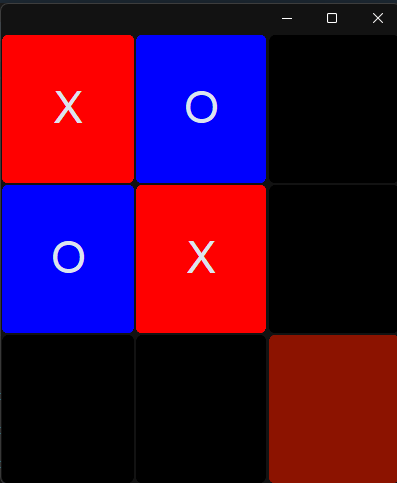
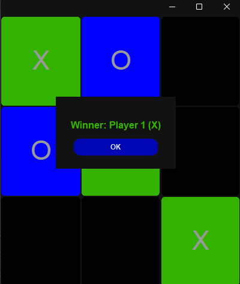

# 🎮 Tic Tac Toe - Python GUI Game

A modern, lightweight implementation of Tic Tac Toe using Python and CustomTkinter.




---

## 🛠 Features

- Turn-based 2-player game (X and O)
- Win and draw detection
- Dynamic color theming (red, blue, green)
- Restart game functionality

---

## 📦 Requirements

- Python 3.8+
- [CustomTkinter](https://github.com/TomSchimansky/CustomTkinter)

Install CustomTkinter:
```bash
pip install customtkinter
```

---

## 🚀 How to Run

1. Clone the repository:
```bash
git clone https://github.com/Basem-2004/tic-tac-toe.git
cd tic-tac-toe
```

2. Run the game:
```bash
python "tic_tac_toe.py"
```

---

## 🖥️ File Structure

```bash
.
├── tic_tac_toe.py           # Main application
├── settings.py              # Theme and layout 
├── empty.ico                # Custom window icon
├── tic_tac_toe_screenshote.png
├── tic_tac_toe_screenshote2.png
└── README.md
```

---

## 📸 Screenshots


---

## Author

Created by **Basem-2004**
